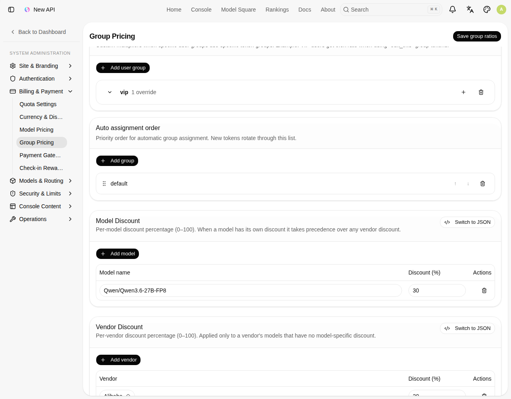
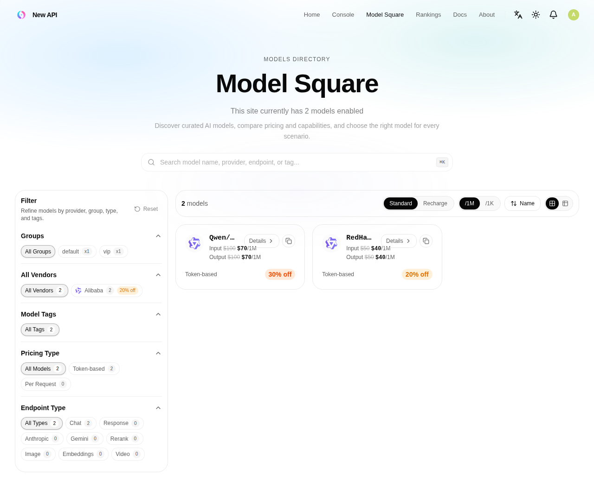

# 모델 / 벤더 할인 — 관리자 사용 가이드

> 이 문서는 **관리자**가 모델·벤더 할인을 어떻게 이해하고, 어디서 설정하고, 어디서 확인하는지 설명합니다.
> 기술 설계는 [design.md](./design.md) 참고.

---

## 1. 개념 한눈에

| 항목 | 설명 |
|---|---|
| **모델 할인 (Model discount)** | 특정 **모델** 1개에 X% 할인 |
| **벤더 할인 (Vendor discount)** | 특정 **벤더(provider)** 의 모델 전체에 X% 할인 |
| **우선순위** | 모델 할인이 있으면 모델 할인 적용, 없으면 그 모델의 벤더 할인, 둘 다 없으면 할인 없음 (**모델 > 벤더 > 없음**) |
| **값** | 할인율 **%**(0~100). 100%면 무료 |
| **적용 범위** | **전역**(모든 사용자). 그룹 비율(GroupRatio)과는 **곱연산**으로 함께 적용 |
| **정가 영향** | 정가(ModelRatio/ModelPrice)는 그대로. 할인은 별도 레이어라 자유롭게 켜고/끔 |

> 예) `gpt-4`에 모델 할인 30%가 있고 OpenAI 벤더 할인 10%가 있으면 → `gpt-4`는 **30%**(모델 우선). OpenAI의 다른 모델(개별 할인 없음)은 **10%**(벤더).

---

## 2. 어디서 설정하나

**경로:** 시스템 설정 → **Billing & Payment → Group Pricing** → 페이지 하단 **Model Discount / Vendor Discount** 에디터
(URL 예: `/system-settings/billing/group-pricing`)



위 화면처럼 두 개의 에디터가 있습니다.

### Model Discount (모델 할인)
- 설명: *Per-model discount percentage (0–100). When a model has its own discount it takes precedence over any vendor discount.*
- **Add model** 버튼 → 행 추가 → **Model name**(모델명)과 **Discount (%)** 입력
  - 모델명은 가격 설정의 모델명과 동일하게 입력(예: `Qwen/Qwen3.6-27B-FP8`)
- 휴지통 아이콘으로 행 삭제

### Vendor Discount (벤더 할인)
- 설명: *Per-vendor discount percentage (0–100). Applied only to a vendor's models that have no model-specific discount.*
- **Add vendor** 버튼 → 벤더 선택(드롭다운, 등록된 벤더 목록) + **Discount (%)** 입력

### 저장 / JSON 모드
- 우상단 **Save group ratios** 버튼으로 저장(이 페이지의 그룹 비율과 함께 저장됨).
- 각 에디터의 **Switch to JSON** 토글로 JSON 직접 편집도 가능:
  - Model: `{ "Qwen/Qwen3.6-27B-FP8": 30 }`
  - Vendor: `{ "Alibaba": 20 }`
- 0~100 범위를 벗어나면 저장이 거부됩니다.

> 저장하면 가격 캐시가 즉시 갱신되어 마켓플레이스와 과금에 곧바로 반영됩니다.

---

## 3. 어디서 확인하나

### (1) 모델 마켓플레이스 (Model Square / 가격 페이지)

**경로:** 상단 메뉴 **Model Square** (URL `/pricing`)



- **벤더 사이드바**: 할인이 있는 벤더 칩에 `20% off` 배지(개수 옆).
- **모델 카드**: 입력/출력 가격이 `~~원가~~ 할인가`(취소선 원가 + 할인 적용가)로 표시되고, **종량제(Token-based) 줄 오른쪽 끝**에 `X% off` 배지.
- **할인율별 색상(히트맵)** — 높을수록 눈에 띔:
  - 1–14% 🟢 에메랄드 / 15–29% 🟡 앰버 / 30–49% 🟠 오렌지 / 50%+ 🔴 빨강
- **모델 상세 보기**(카드의 "세부 정보"): 기본 가격·그룹 가격표에도 할인 적용가와 배지가 표시.
- 동적가격(billingexpr) 모델은 고정가가 없어 **배지만** 표시됩니다.

### (2) 사용 로그 — 요금 계산식

**경로:** 사용 로그 → 로그 행 상세 → **"Show formula"** 펼치기

계산식에서 할인이 **그룹 비율과 분리**되어 표시됩니다:

```
Input: 131 / 1M × $100 × Model discount 0.7 = $0.00917
Output: 498 / 1M × $100 × Model discount 0.7 = $0.03486
```

- 모델 할인이 적용된 모델 → `× Model discount 0.7`
- 벤더 할인이 적용된 모델 → `× Vendor discount 0.8`
- 그룹 비율이 기본값(1)이면 `× Group Ratio 1`은 생략, 할인이 없으면 할인 항도 생략.
- 표시 금액 합 = 실제 청구된 quota와 일치합니다.

> 이 분리 표기는 **새 요청(로그)부터** 적용됩니다. 설정 변경 이전에 쌓인 과거 로그는 옛 형식으로 보일 수 있습니다.

---

## 4. 동작 규칙 / 주의

- **모델 > 벤더 > 없음**: 한 모델에는 둘 중 하나만 적용됩니다(동시 적용 아님).
- **그룹 비율과 곱연산**: 최종 배수 = `GroupRatio × Discount`. 예) 그룹 0.9 + 모델 할인 30% → 0.9 × 0.7 = 0.63.
- **정가는 불변**: 할인을 꺼도 원래 단가가 그대로 복원됩니다(정가를 직접 내리는 것과 다름).
- **벤더명 기준**: 벤더 할인은 벤더 "이름"으로 매칭됩니다. 벤더명을 변경하면 할인 설정을 다시 맞춰야 합니다.
- **100% 할인**: 허용됩니다(무료). 신중히 사용하세요.
- 할인 표시/과금은 rate limit과 무관합니다.

---

## 5. 빠른 시작 예시

1. 시스템 설정 → Billing & Payment → **Group Pricing** 이동
2. **Model Discount → Add model** → `gpt-4` / `25` 입력
3. **Vendor Discount → Add vendor** → `OpenAI` 선택 / `10` 입력
4. 우상단 **Save group ratios** 클릭
5. **Model Square**(`/pricing`)에서 `gpt-4` 카드에 `25% off`(앰버), OpenAI의 다른 모델에 `10% off`(에메랄드) 확인
6. 해당 모델로 요청 후 **사용 로그 상세 → Show formula**에서 `× Model discount 0.75` / `× Vendor discount 0.9` 확인
