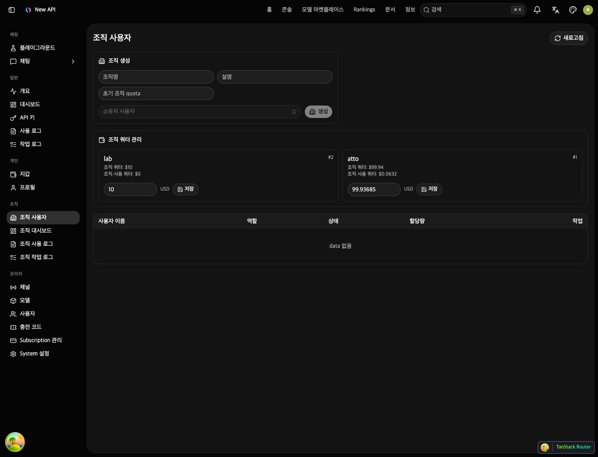
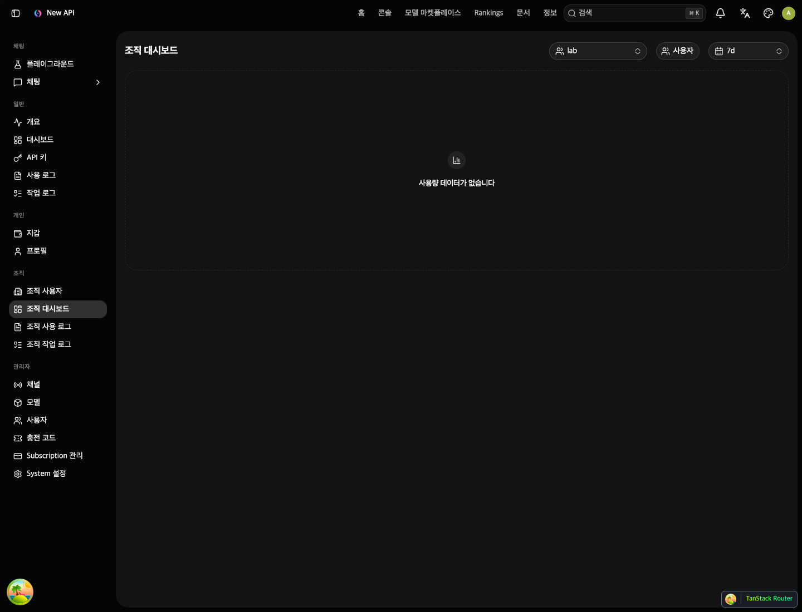
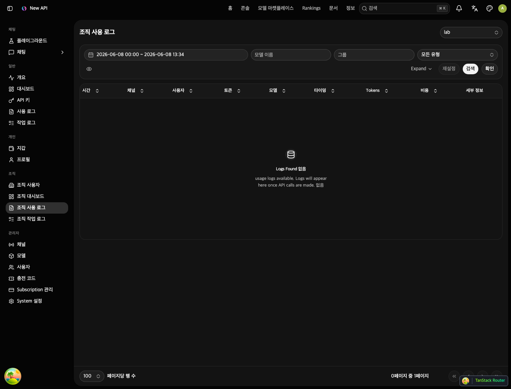
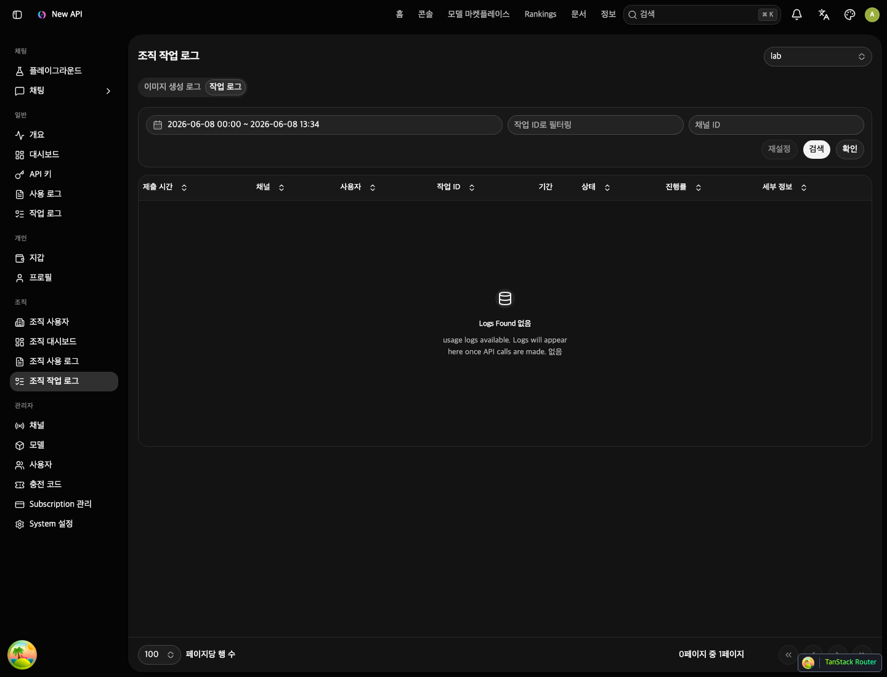
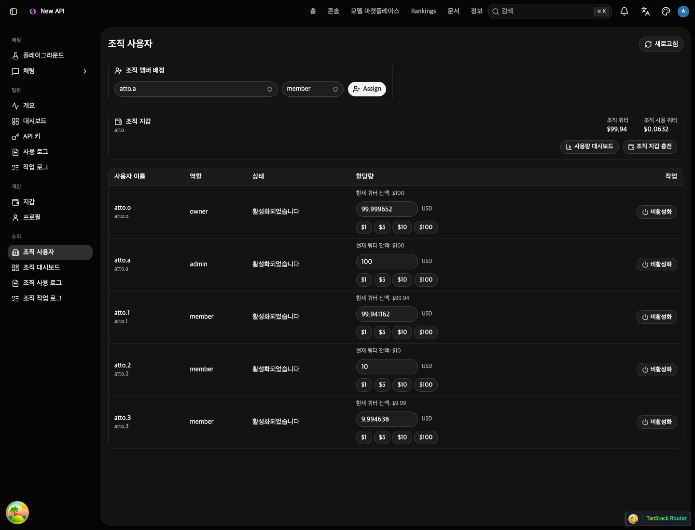
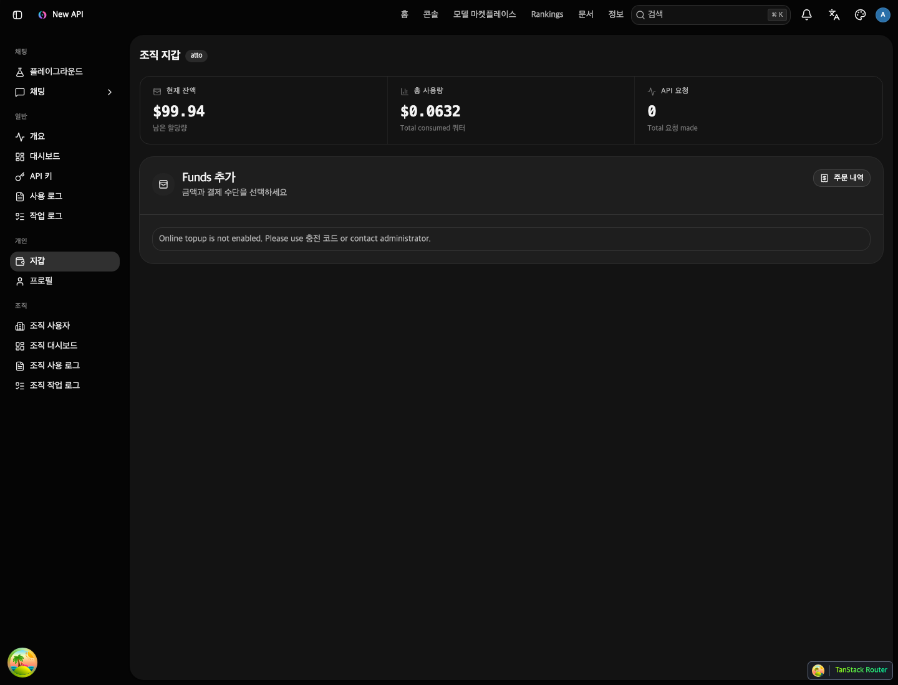
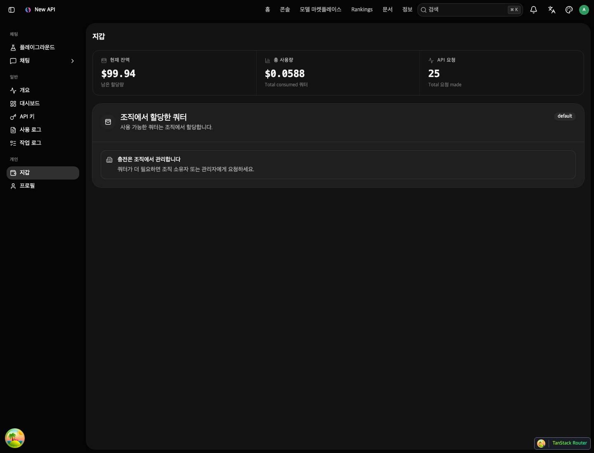

# 조직 기능 사용 매뉴얼

## 문서 개요

이 문서는 조직 기능을 실제 운영 화면에서 사용하는 방법을 설명한다. 조직 기능은 개인 사용자 단위로만 quota를 관리하던 흐름에 조직 단위 사용자 관리, 조직 quota 지갑, 조직 사용량 모니터링을 추가한 기능이다.

대상 독자:

- 전체 관리자
- 조직 소유자
- 조직 관리자
- 조직 일반 사용자

## 핵심 개념

### 전체 관리자

전체 관리자는 시스템 전체를 관리하는 전역 관리자다. 조직 기능에서는 조직을 생성하고, 조직 소유자를 지정하고, 조직 quota를 조정하며, 모든 조직의 대시보드와 로그를 조직 선택 방식으로 조회할 수 있다.

### 조직 소유자

조직 소유자는 특정 조직의 책임자다. 조직 사용자 관리, 조직 사용자 역할 변경, 조직 지갑 충전, 조직 대시보드와 로그 조회를 수행한다.

### 조직 관리자

조직 관리자는 조직 내 사용자 운영과 사용량 모니터링을 담당한다. 사용자 추가, 역할 변경(member ↔ admin), 제거, quota, 상태 관리를 수행하고 조직 대시보드와 로그를 볼 수 있다. 조직 지갑 충전과 owner 역할 부여는 조직 소유자만 수행한다.

### 조직 일반 사용자

조직 일반 사용자는 조직에서 할당받은 quota 한도 안에서 API를 사용한다. 개인 지갑에서 직접 충전하지 않고, 자신의 할당량과 사용량을 확인한다.

### 조직 quota와 사용자 quota의 차이

조직 quota는 조직 전체가 사용할 수 있는 선불 예산이다. 사용자 quota는 조직 내부에서 각 사용자에게 배정한 사용 한도다.

예를 들어 조직 quota가 `$100`이고, 사용자 A에게 `$5`를 배정했다면 사용자 A는 본인 한도 `$5`와 조직 잔액 `$100`을 모두 만족해야 사용할 수 있다. 사용하면 사용자 quota와 조직 quota가 함께 차감된다.

## 권한별 메뉴

### 전체 관리자 메뉴

전체 관리자는 사이드바에서 다음 조직 메뉴를 볼 수 있다.

- 조직 사용자
- 조직 대시보드
- 조직 사용로그
- 조직 작업로그

전체 관리자는 조직 화면마다 조직 선택 드롭다운을 사용한다. 마지막으로 선택한 조직은 브라우저에 저장되어 다른 메뉴로 이동했다가 돌아와도 유지된다.

### 조직 소유자/관리자 메뉴

조직 소유자와 조직 관리자는 자기 조직 기준으로 다음 메뉴를 볼 수 있다.

- 조직 사용자
- 조직 대시보드
- 조직 사용로그
- 조직 작업로그

조직 소유자는 추가로 조직 지갑 화면을 통해 조직 quota를 충전할 수 있다.

### 조직 일반 사용자 메뉴

조직 일반 사용자는 개인 지갑에서 직접 충전 기능 대신 본인에게 배정된 quota와 사용량을 확인한다.

## 전체 관리자: 조직 생성하기

### 1. 조직 메뉴로 이동

사이드바에서 `조직 사용자` 메뉴로 이동한다.

### 2. 조직 생성 버튼 클릭

조직 생성 다이얼로그에서 다음 값을 입력한다.

- 조직 이름
- 설명
- 소유자
- 초기 조직 quota

소유자 목록에는 아직 어떤 조직에도 속하지 않은 일반 사용자만 표시된다. 이미 조직에 속한 사용자나 전역 관리자 계정은 소유자로 선택할 수 없다.

### 3. 저장

저장하면 조직이 생성되고, 선택한 사용자는 해당 조직의 `owner` 역할을 가진다.

### 주의 사항

- 한 사용자는 하나의 조직에만 속할 수 있다.
- 이미 조직에 속한 사용자는 새 조직 소유자로 지정할 수 없다.
- 전체 관리자는 조직 생성 후 조직 quota를 수정할 수 있다.
- 조직 이름은 64자 이하, 설명은 255자 이하로 입력해야 한다.
- 초기 조직 quota는 0 이상 1,000,000,000 이하만 허용된다.

## 전체 관리자: 조직 quota 조정하기

### 1. 조직 사용자 화면에서 조직 목록 확인

전체 관리자는 조직 목록에서 각 조직의 quota 값을 확인할 수 있다.

### 2. quota 값 수정

조직 quota는 조직 전체 선불 예산이다. 이 값은 조직 구성원이 API를 사용할 때 함께 차감된다.

조직 quota는 0 이상 1,000,000,000 이하로만 저장된다. 화면에서 금액 단위로 입력하더라도 서버에는 quota 단위로 변환되어 저장되며, 변환된 값이 범위를 넘으면 저장되지 않는다.

### 3. 저장

조직 quota가 변경되면 조직 소유자와 조직 사용자는 변경된 조직 예산 기준으로 사용하게 된다.

## 조직 관리자/소유자: 조직에 사용자 추가하기

### 1. 조직 사용자 메뉴로 이동

조직 소유자 또는 조직 관리자로 로그인한 뒤 사이드바에서 `조직 사용자`로 이동한다.

### 2. 멤버 추가

`조직 멤버 할당` 영역의 username 입력 필드에 추가할 사용자의 username을 입력한다.

### 3. 추가 버튼 클릭

`추가` 버튼을 누르거나 Enter 키를 누른다.

- 입력한 username이 존재하지 않으면 "User not found" 오류가 표시된다.
- 추가 성공 시 해당 사용자는 `member` 역할로 조직에 추가된다.

### 4. 역할 변경 (필요한 경우)

추가된 사용자의 역할을 바꾸려면 사용자 목록 테이블의 Role 컬럼에서 드롭다운을 선택한다.

- `member`: 일반 조직 사용자
- `admin`: 조직 관리자 (사용자 추가/제거/역할변경 가능)
- `owner`: 조직 소유자 — owner만 부여 가능

역할 변경 후 상단 저장 배너에서 `저장`을 눌러 확정한다.

## 조직 관리자/소유자: 조직 사용자 관리하기

조직 소유자와 조직 관리자는 조직 사용자 화면에서 다음 작업을 할 수 있다.

- 조직 사용자 목록 조회 (검색/정렬/페이지네이션)
- 사용자 추가 (username 입력, member 역할로 추가)
- 사용자 역할 변경 (Role 컬럼 인라인 편집, owner 제외)
- 사용자 quota 조정
- 사용자 상태 변경 (체크박스 선택 후 일괄 비활성화)
- 사용자 제거 (체크박스 선택 후 일괄 제거, owner 제외)
- remark 수정
- 목록 Export (Excel)
- 목록 Import (Excel)

수정할 수 없는 항목:

- 전역 역할
- 기존 사용자 group
- 비밀번호
- 전역 관리자/root 사용자
- 조직 밖 사용자

입력 제한:

- 사용자 quota: 0 이상 1,000,000,000 이하
- 사용자 상태: 활성 또는 비활성만 선택 가능
- remark: 255자 이하

### 저장/취소 패턴

변경 사항(quota 수정, 상태 변경, 역할 변경, 제거)은 즉시 API 호출되지 않고 pending 상태로 축적된다. 1건 이상의 변경이 있으면 테이블 상단에 배너가 표시된다.

- `저장`: 모든 pending 변경을 일괄 API 호출로 반영
- `모두 취소`: 모든 pending 변경 초기화

### 일괄 작업 툴바

체크박스로 사용자를 선택(복수 가능)하면 검색창 옆에 툴바가 표시된다.

- `비활성화`: 선택한 사용자를 비활성화 예정으로 추가
- `조직에서 제거`: 선택한 사용자를 제거 예정으로 추가

owner 행은 체크박스가 비활성화되어 선택 불가.

## 조직 사용자 quota 설정 방법

조직 사용자 quota는 조직 내부에서 사용자별 사용 한도를 의미한다.

예시:

- 조직 quota: `$100`
- 사용자 A quota: `$3`
- 사용자 B quota: `$10`

사용자 A는 최대 `$3`까지 사용할 수 있고, 실제 사용액은 조직 quota에서도 함께 차감된다.

화면에서는 가능하면 금액 단위로 표시된다. 내부 저장 단위는 quota이며 기준은 다음과 같다.

```text
500,000 quota = $1
```

## 조직 소유자: 조직 지갑 충전하기

### 1. 지갑 메뉴로 이동

조직 소유자로 로그인하면 개인 지갑 대신 조직 지갑 중심 화면을 사용한다.

### 2. 조직 잔액 확인

조직 지갑 화면에서 다음을 확인한다.

- 조직 quota 잔액
- 조직 누적 사용량
- 충전 내역

### 3. 충전 금액 입력

지원되는 결제 수단 중 활성화된 결제 수단으로 충전한다.

지원 가능한 결제 수단:

- Epay
- Stripe
- PayPal
- Creem
- Waffo
- Waffo Pancake

### 4. 결제 완료

결제가 성공하면 개인 quota가 아니라 조직 quota가 증가한다.

## 조직 일반 사용자: 지갑 확인하기

조직 일반 사용자는 지갑 화면에서 직접 충전하지 않는다. 대신 다음 정보를 확인한다.

- 본인에게 할당된 quota
- 본인의 사용량
- 조직에서 quota를 할당한다는 안내

quota가 부족하면 조직 소유자 또는 조직 관리자에게 quota 할당을 요청해야 한다.

## 조직 대시보드 사용하기

### 접근 권한

조직 대시보드는 다음 사용자가 접근할 수 있다.

- 전체 관리자
- 조직 소유자
- 조직 관리자

조직 일반 사용자는 접근할 수 없다.

### 전체 관리자 화면

전체 관리자는 대시보드 상단에서 조직을 선택한다. 선택한 조직 기준으로 대시보드 데이터가 표시된다.

조직 선택은 다음 화면 사이에서 유지된다.

- 조직 대시보드
- 조직 사용로그
- 조직 작업로그

### 조직 소유자/관리자 화면

조직 소유자와 조직 관리자는 별도 조직 선택 없이 자기 조직 기준으로 대시보드를 본다.

### 기간 선택

대시보드에서는 기간을 선택할 수 있다.

- 오늘
- 최근 7일
- 최근 30일

### 요약 카드

상단 요약 카드에서 다음 값을 확인한다.

- 조직 잔액
- 조직 누적 사용량
- 선택 기간 사용량
- 선택 기간 요청 수

### 차트

대시보드에는 다음 차트가 포함된다.

- 조직 사용량 분포
- 모델별 사용량 분석
- 사용자 사용량 순위
- 사용자 사용량 추세

관리자 대시보드와 유사하게 차트 탭과 Top 사용자 수 선택 기능을 제공한다.

### 표

하단 표에서는 다음 정보를 확인한다.

- Top 사용자
- Top 모델

## 조직 사용로그 조회하기

### 접근

사이드바에서 `조직 사용로그`로 이동한다.

### 조회 범위

조직 사용로그는 조직에 속한 사용자들의 일반 API 사용 로그만 표시한다. 조직 밖 사용자 로그는 표시되지 않는다.

전체 관리자는 선택한 조직 기준으로 조회한다. 조직 소유자와 조직 관리자는 자기 조직 기준으로 조회한다.

### 필터

일반 사용로그와 동일한 방식으로 다음 필터를 사용할 수 있다.

- 로그 유형
- 모델
- 토큰
- 사용자명
- 채널
- 그룹
- 요청 ID
- upstream 요청 ID
- 기간

## 조직 작업로그 조회하기

### 접근

사이드바에서 `조직 작업로그`로 이동한다.

### 작업로그 종류

조직 작업로그 화면은 다음 종류를 포함한다.

- 작업 로그
- 그리기/이미지 작업 로그

탭 또는 메뉴를 통해 전환할 수 있다.

### 조회 범위

선택한 조직 또는 자기 조직의 사용자들이 만든 작업만 표시한다.

## 전체 관리자용 조직 선택 유지

전체 관리자가 조직 대시보드, 조직 사용로그, 조직 작업로그에서 조직을 선택하면 마지막 선택값이 브라우저 localStorage에 저장된다.

동작 예시:

1. 조직 대시보드에서 `atto` 조직 선택
2. 관리자 메뉴의 사용자 관리로 이동
3. 다시 조직 대시보드로 이동
4. `atto` 조직이 그대로 선택됨

저장 키:

```text
organization:last-selected-id
```

## 테스트 시나리오

### 시나리오 1: 전체 관리자가 조직 생성

1. 전체 관리자로 로그인한다.
2. 조직 사용자 메뉴로 이동한다.
3. 조직 생성 버튼을 누른다.
4. 조직 이름과 소유자를 입력한다.
5. 저장한다.
6. 소유자 계정으로 로그인해 조직 메뉴가 보이는지 확인한다.

### 시나리오 2: 조직 소유자가 사용자 추가

1. 조직 소유자로 로그인한다.
2. 조직 사용자 메뉴로 이동한다.
3. 사용자 할당 버튼을 누른다.
4. 조직에 속하지 않은 일반 사용자를 선택한다.
5. 역할을 `member` 또는 `admin`으로 지정한다.
6. 저장한다.

### 시나리오 3: 조직 사용자 quota 할당

1. 조직 소유자 또는 조직 관리자로 로그인한다.
2. 조직 사용자 메뉴에서 대상 사용자를 찾는다.
3. quota 값을 입력한다.
4. 저장한다.
5. 대상 사용자로 로그인해 지갑에서 할당량을 확인한다.

### 시나리오 4: 조직 quota 충전

1. 조직 소유자로 로그인한다.
2. 지갑 메뉴로 이동한다.
3. 조직 지갑 잔액을 확인한다.
4. 충전 금액을 입력한다.
5. 결제를 진행한다.
6. 조직 quota가 증가했는지 확인한다.

### 시나리오 5: 조직 사용량 모니터링

1. 조직 사용자로 API를 호출한다.
2. 조직 소유자 또는 조직 관리자로 로그인한다.
3. 조직 대시보드로 이동한다.
4. 기간을 최근 7일로 선택한다.
5. 요약 카드, 사용자 차트, 모델 차트에 사용량이 표시되는지 확인한다.
6. 조직 사용로그에서 해당 요청 로그가 보이는지 확인한다.

### 시나리오 6: 전체 관리자 조직별 로그 조회

1. 전체 관리자로 로그인한다.
2. 조직 사용로그로 이동한다.
3. 조직 선택 드롭다운에서 조직 A를 선택한다.
4. 조직 A 사용자 로그만 보이는지 확인한다.
5. 조직 B로 바꿔 조직 B 로그만 보이는지 확인한다.
6. 다른 메뉴로 갔다가 돌아와 마지막 선택 조직이 유지되는지 확인한다.

## 자주 발생하는 오류

### 조직 quota 부족

메시지 예:

```text
组织额度不足, 剩余额度: $0.000000
```

원인:

- 조직 자체 quota 잔액이 부족하다.

해결:

- 조직 소유자가 조직 지갑에서 충전한다.
- 전체 관리자가 조직 quota를 직접 조정한다.

### 사용자 quota 부족

원인:

- 조직 quota는 충분하지만 해당 사용자에게 할당된 quota가 부족하다.

해결:

- 조직 소유자 또는 조직 관리자가 조직 사용자 화면에서 해당 사용자 quota를 늘린다.

### 사용자 할당 권한 없음

원인:

- 조직 일반 사용자가 사용자 할당을 시도했다.
- 조직 관리자가 owner 권한이 필요한 작업을 시도했다.
- 대상 사용자가 다른 조직에 속해 있다.

해결:

- 조직 소유자로 작업한다.
- 대상 사용자가 조직에 속하지 않은 일반 사용자인지 확인한다.

### 조직 선택 후 데이터가 비어 있음

원인:

- 선택한 기간에 사용량이 없다.
- 해당 조직 사용자가 아직 API를 호출하지 않았다.

해결:

- 기간을 최근 30일로 변경한다.
- 조직 사용자가 실제 API 호출을 수행했는지 확인한다.

## 화면 예시

### 전체 관리자: 조직 사용자

전체 관리자는 조직 사용자 화면에서 조직을 생성하고, 조직 quota를 조정하고, 조직별 사용자를 확인한다. 조직 생성 영역의 소유자 목록에는 아직 조직에 속하지 않은 일반 사용자만 표시된다.



### 전체 관리자: 조직 대시보드

전체 관리자는 상단의 조직 선택 드롭다운에서 조회할 조직을 선택한다. 선택한 조직은 조직 대시보드, 조직 사용로그, 조직 작업로그 화면 사이에서 유지된다.



### 전체 관리자: 조직 사용로그

조직 사용로그는 선택한 조직의 일반 API 사용 로그를 조회하는 화면이다. 조직 소유자와 조직 관리자는 자기 조직 기준으로 같은 화면을 사용한다.



### 전체 관리자: 조직 작업로그

조직 작업로그는 선택한 조직의 비동기 작업성 로그를 조회하는 화면이다. 작업 로그도 조직 선택 상태를 유지한다.



### 조직 소유자: 조직 사용자 관리

조직 소유자는 조직 멤버를 배정하고, 사용자별 역할과 quota를 관리한다. 화면 상단의 조직 지갑 영역에서 조직 quota와 조직 사용 quota를 확인할 수 있다.



### 조직 소유자: 조직 지갑

조직 소유자가 지갑 메뉴로 이동하면 개인 지갑 대신 조직 지갑 화면이 표시된다. 여기서 조직 quota 잔액, 사용량, 충전 기능을 확인한다.



### 조직 일반 사용자: 지갑 요약

조직 일반 사용자는 지갑 화면에서 직접 충전하지 않는다. 본인에게 할당된 quota와 사용량을 확인하고, quota가 필요하면 조직 소유자 또는 조직 관리자에게 요청한다.



## 운영 팁

- 조직 quota는 조직 전체 예산이므로 조직 소유자에게 잔액 확인 책임을 둔다.
- 사용자 quota는 내부 사용 한도이므로 팀원별 예산 제한에 사용한다.
- 전체 관리자는 조직 사용자도 일반 사용자 목록에서 볼 수 있지만, 조직 운영 관점의 사용량은 조직 대시보드에서 확인하는 것이 좋다.
- 조직 사용량 테스트 시에는 조직 quota와 사용자 quota가 모두 충분한지 먼저 확인한다.
- 조직 대시보드에 그래프가 나오지 않으면 사용량 로그가 실제로 생성되었는지 조직 사용로그에서 먼저 확인한다.
