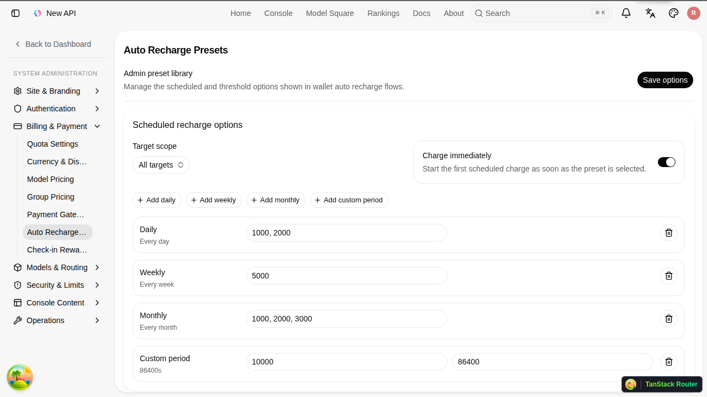
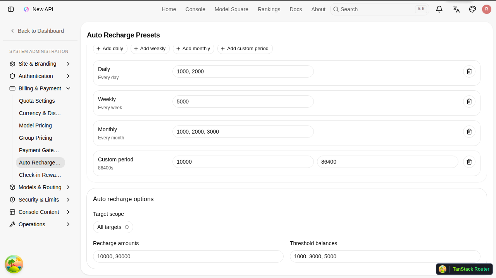

# 정기충전/자동충전 관리자 매뉴얼

작성일: 2026-06-30

## 1. 문서 개요

이 문서는 관리자가 지갑 정기충전과 자동충전 프리셋을 설정하고 운영하는 방법을 설명한다.

정기충전/자동충전은 기존 구독 기능과 별개다. 구독은 플랜과 사용권 중심이고, 정기충전/자동충전은 일반 지갑 충전 금액을 자동으로 추가하는 기능이다.

## 2. 관리자에게 필요한 사전 조건

기능을 운영하려면 다음 조건이 필요하다.

- Toss 결제 설정이 완료되어 있어야 한다.
- Toss 빌링키 결제에 필요한 client key/secret key가 설정되어 있어야 한다.
- `ServerAddress`가 외부에서 접근 가능한 올바른 주소여야 한다.
- Toss 최소 충전 금액보다 작은 프리셋은 만들 수 없다.

현재 기본 최소 충전 금액은 1000원이다. 관리 화면과 사용자 화면에서 보이는 금액 단위는 원(KRW)이다.

## 3. 메뉴 위치

관리자 계정으로 로그인한 뒤 다음 메뉴로 이동한다.

1. `System Settings`
2. `Billing & Payment`
3. `Auto Recharge Presets`

화면 예시:



## 4. 화면 구성

관리 화면은 크게 두 영역으로 나뉜다.

- Scheduled recharge options: 정기충전 선택지 관리
- Auto recharge options: 자동충전 선택지 관리

오른쪽 상단의 `Save options` 버튼을 눌러야 변경사항이 저장된다.

## 5. Target scope 이해하기

각 옵션 영역에는 `Target scope`가 있다.

- `All targets`: 개인 지갑과 조직 지갑 모두에 노출
- `User wallets`: 개인 지갑에만 노출
- `Organization wallets`: 조직 지갑에만 노출

정기충전과 자동충전은 각각 별도의 target scope를 가진다. 예를 들어 정기충전은 개인/조직 모두에 열고, 자동충전은 조직 지갑에만 열 수 있다.

## 6. 정기충전 옵션 설정

정기충전은 지정한 기간마다 지정 금액을 자동으로 충전한다.

### 6.1 기간 추가

`Scheduled recharge options` 영역에서 다음 버튼을 사용할 수 있다.

- `Add daily`: 매일
- `Add weekly`: 매주
- `Add monthly`: 매월
- `Add custom period`: 사용자 지정 초 단위 기간

관리자가 선택한 기간 종류가 사용자 화면의 기간 버튼이 된다.

### 6.2 같은 기간에 여러 금액 추가

각 기간 행의 `Recharge amounts` 입력칸에 여러 금액을 입력할 수 있다.

입력 예:

```text
1000, 2000, 3000
```

다음 형태도 허용된다.

```text
1000 2000 3000
```

```text
1000
2000
3000
```

저장하면 같은 기간 안에 여러 충전 금액 버튼이 생긴다.

예:

- 월별 `1000, 2000, 3000` 입력
- 사용자 화면에는 `Monthly` 기간 선택 후 `1000`, `2000`, `3000` 금액 버튼 표시

### 6.3 custom period

`Add custom period`를 누르면 custom 기간 행이 추가된다.

입력 항목:

- 충전 금액 목록
- custom seconds

예:

- 금액: `10000`
- custom seconds: `86400`

이 설정은 86400초마다 10000원을 충전하는 프리셋으로 저장된다.

### 6.4 Charge immediately

`Charge immediately`를 켜면 사용자가 정기충전을 등록하고 Toss 빌링키 등록을 완료한 직후 첫 충전이 즉시 실행된다.

꺼져 있으면 첫 충전은 다음 주기 도래 시점에 실행된다.

운영 권장:

- 일반적인 월 정기충전 상품처럼 등록 즉시 잔액을 채우고 싶으면 켠다.
- 다음 달부터 결제되도록 만들고 싶으면 끈다.

## 7. 자동충전 옵션 설정

자동충전은 잔액이 기준 금액 이하로 떨어졌을 때 지정 금액을 자동으로 충전한다.

화면 예시:



### 7.1 Recharge amounts

자동충전 시 결제할 금액 목록이다.

예:

```text
10000, 30000, 50000
```

사용자 화면에는 먼저 이 값들이 충전 금액 버튼으로 표시된다.

### 7.2 Threshold balances

자동충전을 실행할 기준 잔액 목록이다.

예:

```text
1000, 3000, 5000
```

사용자가 충전 금액을 선택한 뒤 기준 금액을 고른다.

### 7.3 저장되는 조합

자동충전은 충전 금액과 기준 금액의 모든 조합으로 저장된다.

예:

- Recharge amounts: `10000, 30000`
- Threshold balances: `1000, 3000, 5000`

저장 결과:

- 10000원 충전 / 1000원 이하
- 10000원 충전 / 3000원 이하
- 10000원 충전 / 5000원 이하
- 30000원 충전 / 1000원 이하
- 30000원 충전 / 3000원 이하
- 30000원 충전 / 5000원 이하

## 8. 저장 동작

`Save options`를 누르면 화면의 옵션 상태가 프리셋 목록으로 변환된다.

저장 시 수행되는 작업:

- 새 조합은 생성
- 기존 조합은 수정
- 화면에서 제거된 조합은 비활성화

삭제는 물리 삭제가 아니다. 기존 프리셋 row는 `enabled=false`가 되고, 사용자 화면에는 더 이상 표시되지 않는다.

## 9. 기존 사용자 정책과 프리셋 변경의 관계

중요한 운영 정책:

- 사용자가 프리셋을 선택하면 해당 시점의 값이 실행 정책에 복사된다.
- 이후 관리자가 프리셋 금액이나 기준값을 바꿔도 이미 등록된 사용자 정책은 자동 변경되지 않는다.
- 기존 사용자 정책을 새 값으로 바꾸려면 사용자가 기존 정책을 취소하고 새 프리셋을 다시 선택해야 한다.

이 방식은 이미 동의받은 자동결제 조건이 운영자 변경으로 갑자기 달라지는 일을 막기 위한 것이다.

## 10. 사용자 메뉴 노출 조건

사용자 화면에는 프리셋이 있을 때만 해당 메뉴가 보인다.

- 정기충전 프리셋이 없으면 `Scheduled recharge` 탭이 숨겨진다.
- 자동충전 프리셋이 없으면 `Auto recharge` 탭이 숨겨진다.
- 이미 active 또는 pending 정책이 있는 경우에는 취소/상태 확인을 위해 해당 탭이 유지된다.

관리자가 특정 기능을 아직 열고 싶지 않다면 해당 영역의 값을 모두 비워 저장하면 된다.

## 11. 운영 예시

### 11.1 개인/조직 모두에 월 정기충전 열기

1. `Scheduled recharge options`로 이동한다.
2. `Target scope`를 `All targets`로 둔다.
3. `Add monthly`를 누른다.
4. 월별 금액에 `10000, 30000, 50000`을 입력한다.
5. 필요하면 `Charge immediately`를 켠다.
6. `Save options`를 누른다.

사용자에게 보이는 흐름:

- `Scheduled recharge`
- `Monthly`
- `10000`, `30000`, `50000`

### 11.2 개인 지갑에만 자동충전 열기

1. `Auto recharge options`로 이동한다.
2. `Target scope`를 `User wallets`로 선택한다.
3. `Recharge amounts`에 `10000, 30000`을 입력한다.
4. `Threshold balances`에 `1000, 3000`을 입력한다.
5. `Save options`를 누른다.

사용자에게 보이는 흐름:

- `Auto recharge`
- 충전 금액 `10000` 또는 `30000`
- 기준 금액 `1000` 또는 `3000`

### 11.3 메뉴 자체를 숨기기

정기충전을 숨기려면:

1. `Scheduled recharge options`의 모든 기간 행을 삭제한다.
2. `Save options`를 누른다.

자동충전을 숨기려면:

1. `Recharge amounts`와 `Threshold balances`를 비운다.
2. `Save options`를 누른다.

## 12. 제한과 보호 장치

자동충전에는 과도한 반복 결제를 막기 위한 제한이 있다.

- 충전 성공 후 1시간 쿨다운
- 하루 최대 3회
- 3회 실패하면 정책 상태가 failed로 변경

정기충전과 자동충전 모두 같은 대상에서 유형별 하나만 활성화할 수 있다.

예:

- 개인 지갑 정기충전 1개
- 개인 지갑 자동충전 1개
- 조직 지갑 정기충전 1개
- 조직 지갑 자동충전 1개

## 13. 문제 해결

### 사용자에게 메뉴가 보이지 않음

확인할 것:

- 해당 유형의 프리셋이 enabled 상태인지
- target scope가 사용자 지갑/조직 지갑과 맞는지
- 사용자가 이미 active/pending 정책을 가지고 있는지

### 사용자가 정책 등록을 시작할 수 없음

확인할 것:

- Toss 결제가 활성화되어 있는지
- Toss client key/secret key가 설정되어 있는지
- `ServerAddress`가 올바른 외부 URL인지
- 사용자가 결제 컴플라이언스 조건을 통과했는지

### 결제는 됐는데 잔액이 안 늘어난 것처럼 보임

이번 정기충전/자동충전은 일반 `top_ups` 성공 처리와 연결되어 잔액이 증가하도록 설계되어 있다.

확인할 것:

- `top_ups` row 상태가 success인지
- `wallet_auto_recharges.last_trade_no` 값이 있는지
- `last_error`에 reconciliation pending 메시지가 있는지
- 다음 작업 tick에서 정산 재개가 되었는지

### 금액 입력이 저장되지 않음

확인할 것:

- 금액이 Toss 최소 충전 금액 이상인지
- 쉼표/공백/줄바꿈 외 문자가 섞이지 않았는지
- 자동충전에서 충전 금액은 0보다 큰지
- 기준 금액은 0 이상인지

## 14. E2E 캡처 재생성

문서 스크린샷은 Playwright로 생성했다.

실행 명령:

```bash
cd web/default
SQLITE_PATH='/tmp/wallet-auto-recharge-doc-e2e.db?_busy_timeout=30000' \
GOCACHE=/tmp/go-cache \
E2E_ADMIN_USERNAME=root \
E2E_ADMIN_PASSWORD=12345678 \
E2E_BASE_URL=http://127.0.0.1:3101 \
E2E_BACKEND_URL=http://127.0.0.1:3100 \
bun run e2e -- wallet-auto-recharge-docs.e2e.ts
```

캡처 파일:

- `docs/manuals/images/wallet-auto-recharge/admin-auto-recharge-options.png`
- `docs/manuals/images/wallet-auto-recharge/admin-auto-recharge-threshold-options.png`
