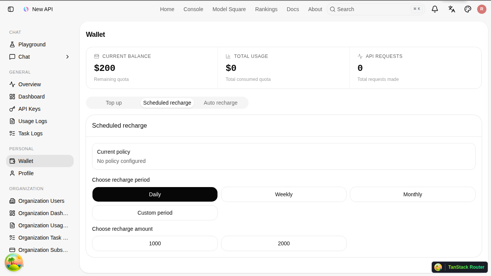
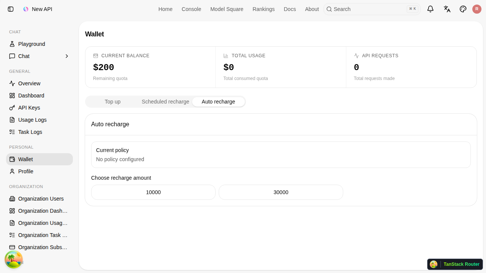
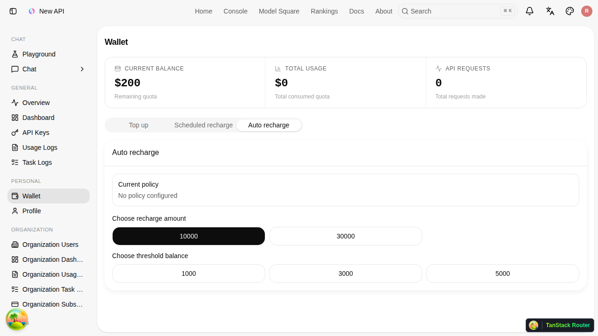

# 정기충전/자동충전 사용자 매뉴얼

작성일: 2026-06-30

## 1. 문서 개요

이 문서는 사용자가 지갑에서 정기충전과 자동충전을 설정하고 취소하는 방법을 설명한다.

정기충전과 자동충전은 기존 구독과 다르다. 구독은 별도 사용권을 부여하는 방식이고, 정기충전/자동충전은 일반 지갑 충전처럼 사용 가능한 잔액을 늘리는 방식이다.

## 2. 기본 개념

### 2.1 정기충전

정기충전은 정해진 기간마다 선택한 금액을 자동으로 충전한다.

예:

- 매월 10000원 충전
- 매주 5000원 충전
- 매일 1000원 충전

관리자가 허용한 기간과 금액만 선택할 수 있다.

### 2.2 자동충전

자동충전은 잔액이 기준 금액 이하로 떨어지면 선택한 금액을 자동으로 충전한다.

예:

- 잔액이 3000원 이하가 되면 10000원 충전
- 잔액이 5000원 이하가 되면 30000원 충전

관리자가 허용한 충전 금액과 기준 금액만 선택할 수 있다.

### 2.3 금액 단위

화면에 보이는 충전 금액과 기준 금액은 원(KRW)이다.

내부적으로는 서비스의 quota 단위로 변환되어 잔액에 반영된다.

## 3. 메뉴 위치

개인 지갑:

1. 로그인한다.
2. 사이드바에서 `Wallet` 메뉴로 이동한다.
3. 상단 탭에서 `Scheduled recharge` 또는 `Auto recharge`를 선택한다.

조직 지갑:

1. 조직 소유자로 로그인한다.
2. 사이드바에서 `Organization Wallet`로 이동한다.
3. `Scheduled recharge` 또는 `Auto recharge`를 선택한다.

조직 지갑의 정기충전/자동충전은 조직 소유자만 설정할 수 있다.

## 4. 메뉴가 보이지 않을 때

관리자가 해당 기능을 열어두지 않으면 메뉴가 보이지 않는다.

- 정기충전 프리셋이 없으면 `Scheduled recharge` 탭이 보이지 않는다.
- 자동충전 프리셋이 없으면 `Auto recharge` 탭이 보이지 않는다.
- 이미 설정한 정책이 있으면 취소와 상태 확인을 위해 탭이 유지될 수 있다.

## 5. 정기충전 설정하기

정기충전 화면 예시:

### 5.1 정기충전 탭 열기

지갑 화면에서 `Scheduled recharge` 탭을 선택한다.

화면에는 현재 정책과 선택 가능한 옵션이 표시된다.

현재 정책이 없으면:

- `No policy configured`가 표시된다.
- 기간과 금액을 선택할 수 있다.

현재 정책이 있으면:

- 충전 금액
- 충전 주기
- 다음 결제 예정 시간
- 등록된 카드 정보
- 취소 버튼

이 표시된다.

### 5.2 기간 선택

관리자가 여러 기간을 열어두면 기간 버튼이 먼저 표시된다.

예:

- Daily
- Weekly
- Monthly
- Custom period

원하는 기간을 선택한다.

관리자가 기간을 하나만 열어둔 경우에는 기간 선택 단계가 생략되고 금액 선택만 표시될 수 있다.

### 5.3 금액 선택

기간을 선택하면 해당 기간에 연결된 충전 금액 버튼이 표시된다.

예:

- Daily 선택 시 `1000`, `2000`
- Monthly 선택 시 `1000`, `2000`, `3000`

원하는 금액 버튼을 누르면 Toss 결제수단 등록 흐름이 시작된다.

### 5.4 Toss 빌링키 등록

정기충전을 사용하려면 Toss에서 자동결제용 결제수단을 등록해야 한다.

흐름:

1. 금액 버튼을 누른다.
2. 서비스가 pending 정책을 만든다.
3. Toss 빌링키 등록 화면으로 이동한다.
4. 카드 등록과 인증을 완료한다.
5. 서비스로 돌아온다.
6. 정책이 active 상태가 된다.

관리자가 `Charge immediately`를 켜둔 프리셋이면 등록 직후 첫 충전이 실행된다. 꺼져 있으면 다음 주기부터 충전된다.

## 6. 자동충전 설정하기

자동충전 화면 예시:

### 6.1 자동충전 탭 열기

지갑 화면에서 `Auto recharge` 탭을 선택한다.

현재 정책이 없으면 충전 금액 버튼이 표시된다.

### 6.2 충전 금액 선택

먼저 자동으로 충전할 금액을 선택한다.

예:

- 10000
- 30000

관리자가 해당 충전 금액에 기준 금액을 하나만 연결한 경우에는 바로 Toss 등록 흐름이 시작될 수 있다.

기준 금액이 여러 개이면 다음 단계가 표시된다.

### 6.3 기준 금액 선택

기준 금액 선택 화면:

기준 금액은 자동충전을 실행할 잔액 조건이다.

예:

- 1000 선택: 잔액이 1000원 이하가 되면 충전
- 3000 선택: 잔액이 3000원 이하가 되면 충전
- 5000 선택: 잔액이 5000원 이하가 되면 충전

기준 금액 버튼을 누르면 Toss 빌링키 등록 흐름이 시작된다.

## 7. 현재 정책 확인하기

정기충전 또는 자동충전 탭 상단의 `Current policy` 영역에서 현재 상태를 확인할 수 있다.

표시 항목:

- Recharge amount: 충전 금액
- Charge interval: 정기충전 주기
- Threshold balance: 자동충전 기준 금액
- Next charge: 다음 정기충전 예정 시간
- Card: 등록된 카드 회사와 마스킹 번호

정책이 없으면 `No policy configured`가 표시된다.

## 8. 정책 취소하기

이미 active 또는 pending 정책이 있으면 `Current policy` 영역에 `Cancel` 버튼이 표시된다.

취소 방법:

1. 지갑에서 해당 탭을 연다.
2. `Current policy`를 확인한다.
3. `Cancel` 버튼을 누른다.
4. 취소가 완료되면 새 정책을 다시 선택할 수 있다.

취소 후에는 해당 정기충전 또는 자동충전이 더 이상 실행되지 않는다.

## 9. 개인 지갑과 조직 지갑 차이

### 개인 지갑

개인 지갑의 정기충전/자동충전은 로그인한 사용자 본인의 잔액을 충전한다.

결제 책임자:

- 본인

충전 대상:

- 본인 지갑

### 조직 지갑

조직 지갑의 정기충전/자동충전은 조직 지갑 잔액을 충전한다.

결제 책임자:

- 조직 소유자

충전 대상:

- 조직 지갑

조직 관리자나 일반 조직 사용자는 조직 자동결제를 설정할 수 없다.

## 10. 자동충전 실행 조건

자동충전은 잔액이 기준 금액 이하일 때만 실행된다.

예:

- 기준 금액: 3000원
- 현재 잔액: 5000원
- 실행 여부: 실행 안 함

예:

- 기준 금액: 3000원
- 현재 잔액: 3000원
- 실행 여부: 실행

예:

- 기준 금액: 3000원
- 현재 잔액: 1000원
- 실행 여부: 실행

자동충전에는 과도한 반복 결제를 막기 위한 제한이 있다.

- 성공 후 1시간 동안 다시 실행되지 않음
- 하루 최대 3회까지만 실행

## 11. 정기충전 실행 시점

정기충전은 등록된 주기와 다음 결제 예정 시간에 따라 실행된다.

예:

- 매일: 하루 뒤
- 매주: 7일 뒤
- 매월: 한 달 뒤
- custom: 관리자가 정한 초 단위 이후

관리자가 즉시 충전을 켠 경우에는 카드 등록 직후 첫 충전이 실행될 수 있다.

## 12. 결제 실패 시

결제가 실패하면 정책의 실패 횟수가 증가한다.

반복 실패 시:

- 일정 횟수 이상 실패하면 정책이 failed 상태가 된다.
- failed 상태가 되면 자동결제가 더 이상 실행되지 않는다.
- 사용자는 기존 정책을 취소하거나 새 정책을 다시 등록해야 할 수 있다.

실패 원인 예:

- 카드 한도 부족
- 카드 정지 또는 만료
- Toss 빌링키 문제
- 서비스 결제 설정 문제

## 13. 자주 묻는 질문

### Q. 결제되면 잔액이 실제로 늘어나나요?

네. 정기충전과 자동충전은 일반 지갑 충전과 같은 완료 흐름을 사용한다. 결제 성공 후 사용 가능한 잔액이 증가한다.

### Q. 기존 구독과 같이 쓰면 어떻게 되나요?

정기충전/자동충전은 구독과 별도 메뉴다. 이 기능은 구독권을 갱신하지 않고 지갑 잔액을 충전한다.

### Q. 금액을 직접 입력할 수 없나요?

현재는 직접 입력할 수 없다. 관리자가 만든 프리셋 중에서만 선택한다.

### Q. 기준 금액 단위는 무엇인가요?

원(KRW)이다. 화면에 보이는 `1000`은 1000원을 의미한다.

### Q. 이미 설정한 정책 금액을 바꿀 수 있나요?

현재 정책을 직접 수정하는 방식은 아니다. 기존 정책을 취소한 뒤 원하는 새 프리셋을 다시 선택한다.

### Q. 자동충전은 잔액이 얼마나 자주 확인되나요?

서버 작업이 주기적으로 active 자동충전 정책을 확인한다. 현재 구현은 약 1분 단위 작업으로 확인한다.

## 14. E2E 캡처 정보

이 문서의 스크린샷은 Playwright E2E로 생성했다.

테스트 파일:

- `web/default/e2e/wallet-auto-recharge-docs.e2e.ts`

캡처 파일:

- `docs/manuals/images/wallet-auto-recharge/user-wallet-scheduled-recharge.png`
- `docs/manuals/images/wallet-auto-recharge/user-wallet-auto-recharge.png`
- `docs/manuals/images/wallet-auto-recharge/user-wallet-auto-recharge-threshold.png`
